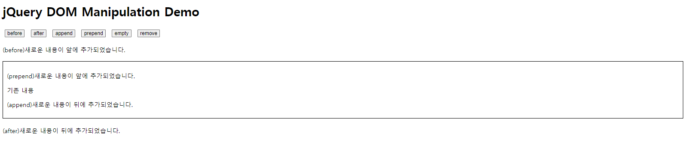

# jQuery를 사용한 DOM 추가 및 삭제

## 1. DOM이란..?
- 문서 객체 모델(Document Object Model)은 HTML, XML의 프로그래밍 인터페이스  
- 문서의 구조화된 표현을 제공하며 프로그래밍 언어가 DOM 구조에 접근할 수 있는 방법을 제공하여 문서 구조, 스타일, 내용 등을 변경할 수 있게 도움

## 2. DOM 요소 추가  
- `before`: 선택한 요소의 앞에 내용 삽입
- `after`: 선택한 요소의 뒤에 내용 삽입
- `prepend`: 선택한 요소의 자식 요소 앞에 내용 삽입
- `append`: 선택한 요소의 자식 요소 뒤에 내용 삽입

## 3. DOM 요소 삭제
- `empty`: 선택한 요소의 모든 자식 요소와 내용을 제거하지만 선택한 요소 자체는 유지
- `remove`: 선택한 요소와 그 자식 요소들을 완전히 제거

## Dom Demo

- [jQuery - Add Elements](https://www.w3schools.com/jquery/jquery_dom_add.asp)
- [jQuery - Remove Elements](https://www.w3schools.com/jquery/jquery_dom_remove.asp)  

## References
- [DOM 소개](https://developer.mozilla.org/ko/docs/Web/API/Document_Object_Model/Introduction)
